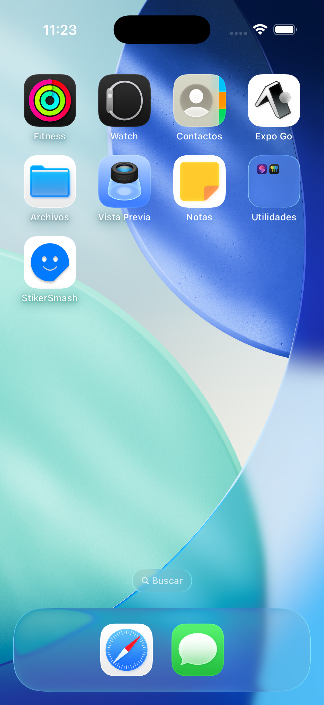
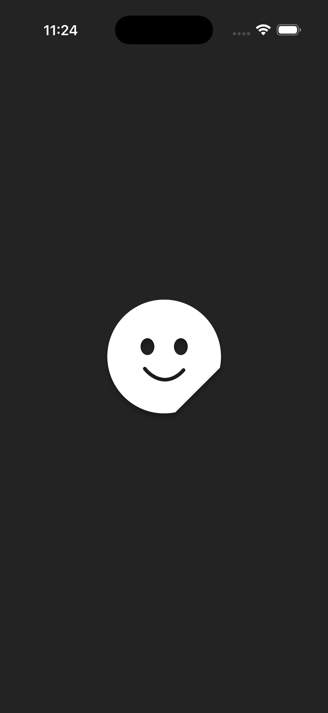
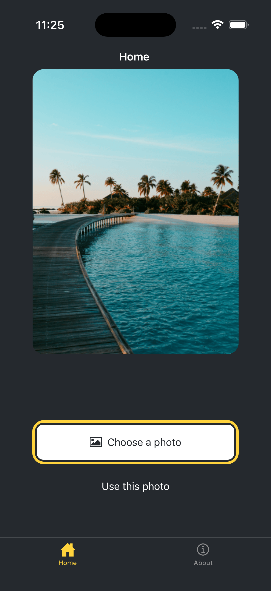

# StikerSmash 💥

Una aplicación interactiva desarrollada en **React Native** y **Expo** que permite a los usuarios personalizar sus fotografías añadiendo divertidos stickers (emojis), manipularlos mediante gestos táctiles (arrastrar, escalar) y guardar la composición final directamente en la galería del dispositivo.

---

## 📸 Galería de la Aplicación

A continuación se muestra el flujo inicial de la aplicación:

  
  &nbsp;&nbsp;&nbsp;&nbsp;
  
  &nbsp;&nbsp;&nbsp;&nbsp;
  

_Nota: La pantalla de carga (Splash Screen) está configurada para mostrarse durante exactamente 3 segundos antes de revelar la interfaz principal, asegurando una transición fluida._

---

## ✨ Características Principales

- **Selección de Imágenes:** Acceso a la galería del dispositivo para elegir la fotografía base.
- **Catálogo de Stickers:** Selector deslizable de emojis personalizados.
- **Motor de Gestos:** Soporte nativo para arrastrar los stickers por la pantalla y redimensionarlos (doble toque/pellizco) con animaciones fluidas a 60fps.
- **Exportación:** Renderizado de la vista final (fotografía + stickers) y guardado automático en el carrete del dispositivo.
- **Diseño Responsivo:** Interfaz limpia y profesional que se adapta automáticamente a los modos claro y oscuro del sistema.

---

## 🛠️ Tecnologías y Herramientas

Este proyecto está construido con un enfoque en el rendimiento y una experiencia de usuario (UX) pulida:

- **[React Native](https://reactnative.dev/):** Framework principal.
- **[Expo](https://expo.dev/):** Entorno de desarrollo, construcción nativa y enrutamiento (`expo-router`).
- **[Reanimated 3](https://docs.swmansion.com/react-native-reanimated/):** Para animaciones fluidas en el hilo de la interfaz de usuario.
- **[Gesture Handler](https://docs.swmansion.com/react-native-gesture-handler/):** Manejo preciso de interacciones físicas (arrastrar, escalar).
- **[Expo Image Picker & Media Library](https://docs.expo.dev/versions/latest/):** Para la gestión de permisos, importación y exportación de medios.

---
