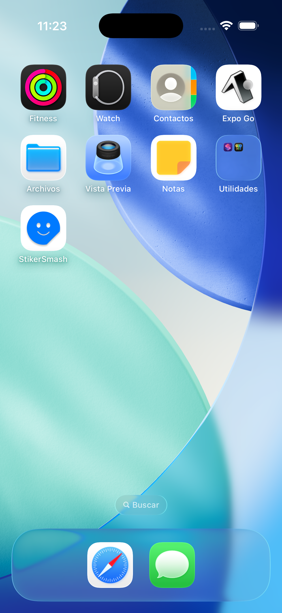
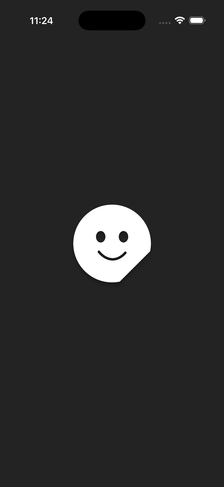
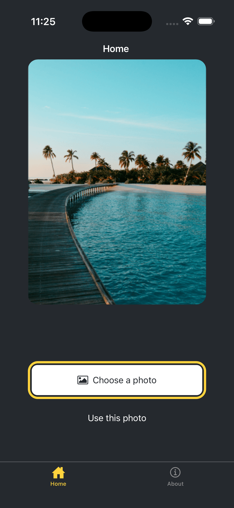
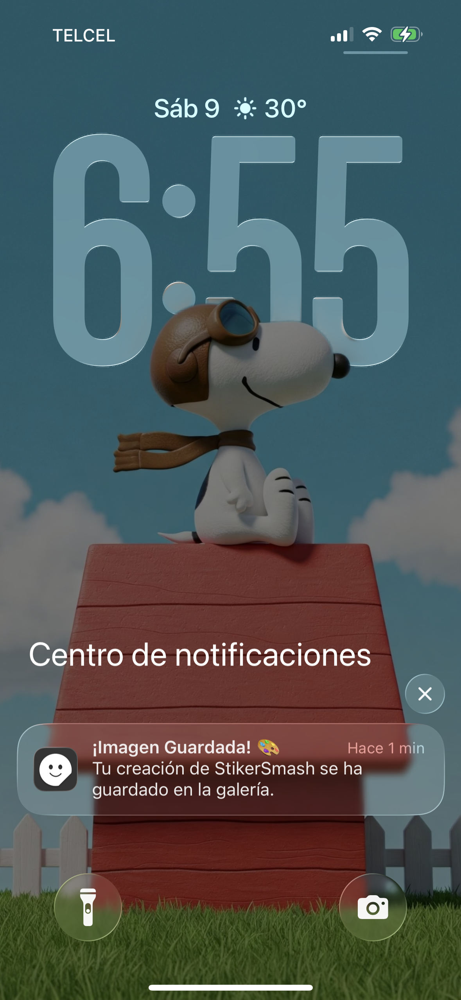

# StickerSmash 💥

Una aplicación interactiva desarrollada en **React Native** y **Expo** que permite a los usuarios personalizar sus fotografías añadiendo divertidos stickers (emojis), manipularlos mediante gestos táctiles (arrastrar, escalar) y guardar la composición final directamente en la galería del dispositivo.

---

## 📸 Galería de la Aplicación

A continuación se muestra el flujo inicial de la aplicación:

<div align="center">
  
  &nbsp;&nbsp;&nbsp;&nbsp;
  
  &nbsp;&nbsp;&nbsp;&nbsp;
  
</div>

_Nota: La pantalla de carga (Splash Screen) está configurada para mostrarse durante exactamente 3 segundos antes de revelar la interfaz principal, asegurando una transición fluida._

---

## ✨ Características Principales

- **Selección de Imágenes:** Acceso a la galería del dispositivo para elegir la fotografía base.
- **Catálogo de Stickers:** Selector deslizable de emojis personalizados.
- **Motor de Gestos:** Soporte nativo para arrastrar los stickers por la pantalla y redimensionarlos (doble toque/pellizco) con animaciones fluidas a 60fps.
- **Exportación:** Renderizado de la vista final (fotografía + stickers) y guardado automático en el carrete del dispositivo.
- **Notificaciones Push & Locales:** Confirmaciones visuales al guardar imágenes y recordatorios para interactuar con la app.
- **Diseño Responsivo:** Interfaz limpia y profesional que se adapta automáticamente a los modos claro y oscuro del sistema.

---

## 🔔 Notificaciones

La aplicación integra un sistema de notificaciones para mejorar la experiencia del usuario, confirmando acciones críticas como el guardado exitoso de archivos o enviando recordatorios de personalización.

### 📸 Vista Previa

<table border="0" style="border-collapse: collapse; border: none; margin-left: auto; margin-right: auto;">
  <tr style="border: none;">
    <td align="center" style="border: none; border-style: hidden; vertical-align: middle; padding: 10px;">
      
    </td>
    <td align="center" style="border: none; border-style: hidden; vertical-align: middle; padding: 10px;">
      <video src="https://github.com/user-attachments/assets/22361b59-4861-493c-a1d2-57d40ee5c347" height="445" controls>
      </video>
    </td>
  </tr>
</table>

---

## 🛠️ Tecnologías y Herramientas

Este proyecto está construido con un enfoque en el rendimiento y una experiencia de usuario (UX) pulida:

- **[React Native](https://reactnative.dev/):** Framework principal.
- **[Expo](https://expo.dev/):** Entorno de desarrollo, construcción nativa y enrutamiento (`expo-router`).
- **[Expo Notifications](https://docs.expo.dev/versions/latest/sdk/notifications/):** Gestión de permisos y envío de mensajes push/locales.
- **[Reanimated 3](https://docs.swmansion.com/react-native-reanimated/):** Para animaciones fluidas en el hilo de la interfaz de usuario.
- **[Gesture Handler](https://docs.swmansion.com/react-native-gesture-handler/):** Manejo preciso de interacciones físicas (arrastrar, escalar).
- **[Expo Image Picker & Media Library](https://docs.expo.dev/versions/latest/):** Gestión de permisos, importación y exportación de medios.

---

## 🚀 Instalación y Uso

1. **Clonar el repositorio:**
   ```bash
   git clone [https://github.com/tu-usuario/StickerSmash.git](https://github.com/tu-usuario/StickerSmash.git)
